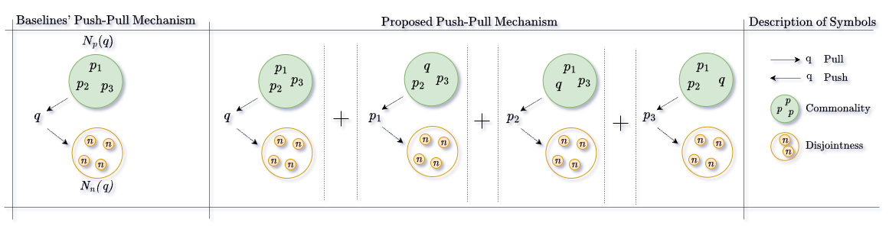

# ANU-RL: A New Perspective on Weakly-Supervised Representation Learning for Visual Place Recognition
Code for the TMLR 2026 paper [ANU-RL: A New Perspective on Weakly-Supervised Representation Learning for Visual Place Recognition](https://openreview.net/pdf?id=mXE4OP55il). Most code snippets are sourced from [MixVPR](https://github.com/amaralibey/mixvpr), [BoQ](https://github.com/amaralibey/Bag-of-Queries), [MSim](https://github.com/msight-tech/research-ms-loss). 

 

### Prepare the data and the pretrained model 

The following script will prepare the [CUB](http://www.vision.caltech.edu.s3-us-west-2.amazonaws.com/visipedia-data/CUB-200-2011/CUB_200_2011.tgz) dataset for training by downloading to the ./resource/datasets/ folder; which will then build the data list (train.txt test.txt):

```bash
./scripts/prepare_cub.sh
```

Download the imagenet pretrained model of 
[bninception](http://data.lip6.fr/cadene/pretrainedmodels/bn_inception-52deb4733.pth) and put it in the folder:  ~/.torch/models/.


### Installation

```bash
pip install -r requirements.txt
```
###  Train and Test on CUB200-2011 with MS-Loss within ANU-RL framework
## Train
```bash
./image retrieval/scripts/run_cub.sh
```
Trained models will be saved in the ./output/ folder if using the default config.
## Test
```bash
./image retrieval/validator.sh
```

### Contact

For any questions, please feel free to reach out 
```
ee21resch01008@iith.ac.in or sumohana@ee.iith.ac.in
```

### Citation

If you use our ANU-RL in your research, please cite as:
```
@article{
uggi2026anurl,
title={{ANU}-{RL}: A New Perspective on Weakly-Supervised Representation Learning for Visual Place Recognition},
author={Anuradha Uggi and Sumohana S. Channappayya},
journal={Transactions on Machine Learning Research},
issn={2835-8856},
year={2026},
url={https://openreview.net/forum?id=mXE4OP55il},
note={}
}
```

